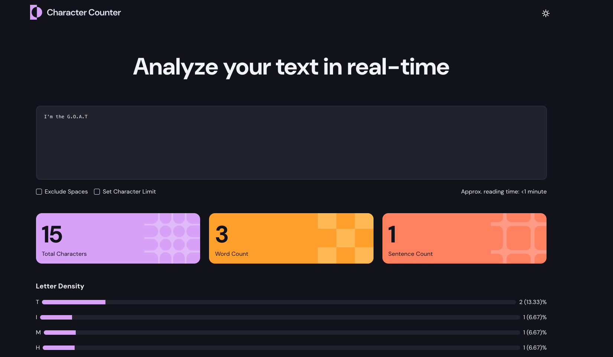

# Character Counter - Frontend Mentor 

This is a solution to the [Character counter challenge on Frontend Mentor](https://www.frontendmentor.io/challenges/character-counter-znSgeWs_i6). 

## Table of contents

- [Overview](#overview)
  - [The challenge](#the-challenge)
  - [Screenshot](#screenshot)
  - [Links](#links)
- [My process](#my-process)
  - [Built with](#built-with)
  - [What I learned](#what-i-learned)
- [Author](#author)


## Overview

### The challenge

Users should be able to:
- Analyze the character, word, and sentence counts for their text
- Exclude/Include spaces in their character count
- Set a character limit
- Receive a warning message if their text exceeds their character limit
- See the approximate reading time of their text
- Analyze the letter density of their text
- Select their color theme
- Navigate the app and perform all actions using only their keyboard
- View the optimal layout for the interface depending on their device's 

### Screenshot



 
### Links

- Live Site URL: [live site](https://charactercounter1.netlify.app/)

## My process

### Built with

- Semantic HTML5 markup
- CSS custom properties
- Flexbox
- CSS Grid
- Mobile-first workflow
- [React](https://reactjs.org/) - JS library


### What I learned


```jsx react useMemo

 const updateCharacterDensity =useMemo(()=>{
    //create a countLetters object and loop through the string
  let countLetters: Record<string, number> = {};
  for (let i = 0; i < allText.length; i++) {
    //convert each character to uppercase
    const char = allText[i].toUpperCase();
    //check again that the character is uppercase
    if (/[A-Z]/.test(char)) {
      countLetters[char] = (countLetters[char] || 0) + 1;
    }
  }

  //let letterDataHolder = [];
  let letterDataHolder: LetterDensity[] = [];

  for (const [key, value] of Object.entries(countLetters)) {
    const percentage = ((value / characterCount) * 100).toFixed(2);
    letterDataHolder.push({ key, percentage: parseFloat(percentage), value });
  }
  return letterDataHolder.sort((a, b) => b.percentage - a.percentage);
},[allText, characterCount])

```

## Author

- Website - [Osaro](https://osaro.vercel.app)
- Frontend Mentor - [@Osaaroh](https://www.frontendmentor.io/profile/osaaroh)


